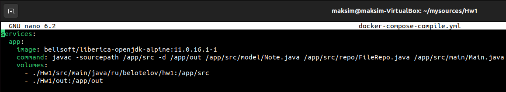
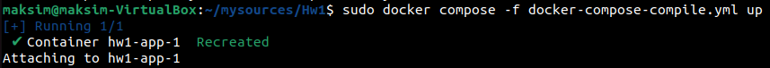
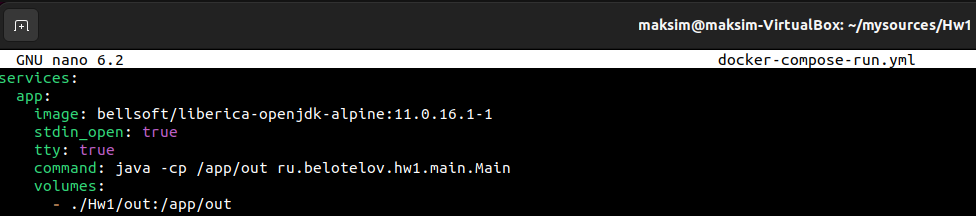
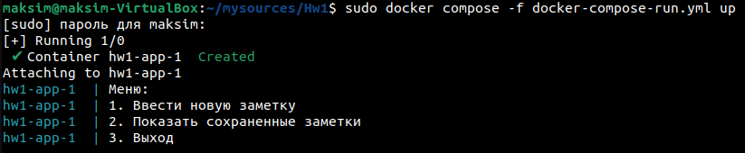

### Домашнее задание 1 
#### Белотелов Максим 
______________

Задание 1.    
Создать приложение с вложенностью пакетов не менее 3х, 
где будет класс для входа и несколько классов с логикой. 
Пример: приложение для внесения заметок во внешний файл с 
обязательной фиксацией времени.
Пример:

Введите заметку: Hello, world!
Дозапись в файл: 16.07.2023 -> Hello, world

Скомпилируйте и запустите посредством CLI.
_____________

Задание 2.
Создать два Docker-образа. Один должен компилировать Java-проект
обратно в папку на компьютере пользователя, а второй забирать 
скомпилированные классы и исполнять их.

________